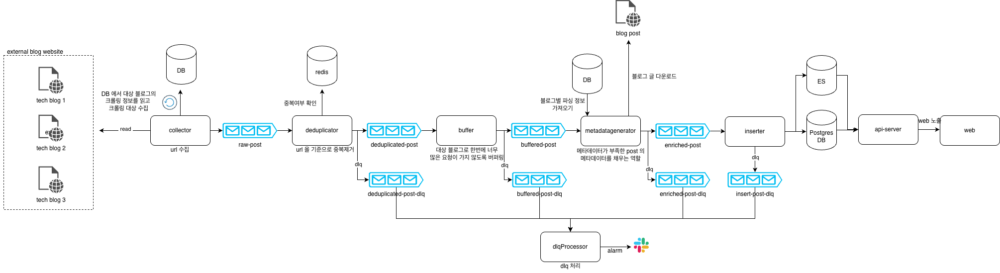

# 용어
- 포스트 : 수집 대상의 블로그 글
- 메타데이터 : 블로그의 썸네일, 태그, 제목 등과 같은 추가적인 데이터

# 아키텍처

## collector
- rss 또는 sitemap 에서 수집 대상 url 을 수집
- rss, sitemap 이 없다면 글 목록 html 을 다운로드 받아서 수집
  - 이때 절대 포스트 세부 페이지를 다운로드 받지 않음. 왜냐하면 해당 요청이 많아지면 대상 서버에 부하가 될 수 있기 때문
- 추가적인 메타데이터를 수집할 수 있다면 함께 수집

## deduplicator
- 수집된 url 인지 확인
- 수집된 url 은 redis 에 넣어서 관리
- redis 는 메인 DB 를 읽어서 주기적인 자동 또는 수동 리프레시

## buffer
- deduplicated-post 를 읽어서 최대 2.5/s 의 속도로 읽음
- deduplicated-post 의 파티션을 8개, key 는 source.
- 8개의 파티션을 round-robin 으로 순회하면서 읽고 buffered-post 로 pub
- 블로그 서버에 부하를 안주기 위한 컴포넌트

# metadatagenerator
- rss 피드, sitemap 등에서 수집되지 않는 메타데이터를 추가함
- 주로 url 로 html 을 다운로드 받아서 파싱해서 사용
- 추가 기능
  - content 를 벡터화하여 태그 추출

# inserter
- 생성된 enriched-post 를 DB 로 insert

# apiserver
- post 를 보여주는 API 서비스

# dlqprocessor
- 각 모듈에서 처리되지 못한 message(dlq)를 처리하는 모듈