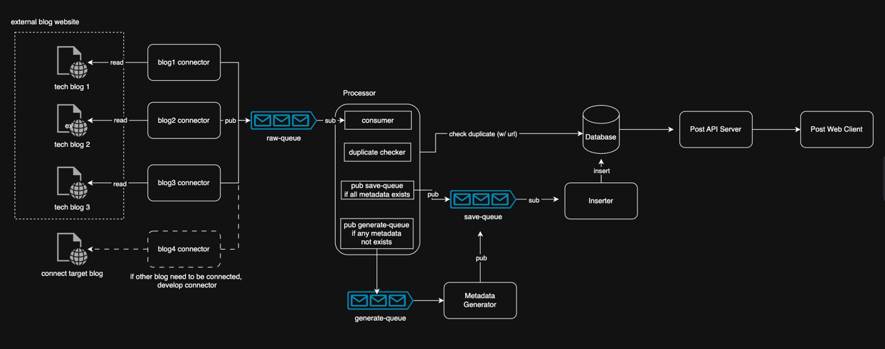

# 아키텍처

## connector
 - 블로그 글을 크롤링
 - 메타데이터를 파싱하여 읽고 raw-queue 로 발행
 - 1개의 블로그 당 1개의 connector 필요 (파싱 방법이 다 다르기 떄문)
## processor
 - raw-queue 에서 데이터를 읽어서 아래 단계 진행
   1. consumer : raw-queue 에서 데이터를 읽음
   2. duplicate checker : url 을 기준으로 중복된 데이터인지 체크
   3. pub save-queue : 모든 메타데이터가 파싱되었다면 save-queue 로 발행
   4. pub generate-queue : 메타데이터가 일부 없다면 generate-queue 로 발행
 
## Metadata Generator
 - generate-queue 에서 데이터를 읽음
 - 블로그 글에서 부족한 메타데이터를 생성 (주로 본문 요약, 카테고리 분류, 태그 생성)
 - save-queue 로 발행

## Inserter
 - save-queue 에서 데이터를 읽음
 - 데이터를 Database 에 저장

## Post API Server
 - Database 에서 데이터를 API 로 출력

## Post Web Client
 - Post API Server로 데이터를 요청
 - 블로그 글을 웹페이지로 출력
